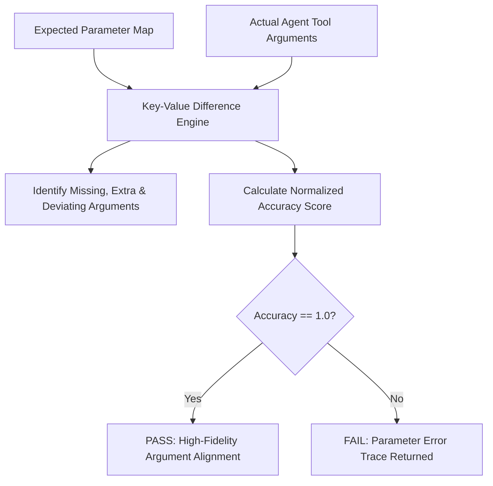

# genpark-tool-call-argument-accuracy-validator-skill

Agent Skill implementing **Tool Invocation Argument Accuracy & Fidelity Validation** in 100% Python standard library.

## Architectural Flow

```mermaid
flowchart TD
    Expected["Expected Parameter Map"] --> Diff["Key-Value Difference Engine"]
    Actual["Actual Agent Tool Arguments"] --> Diff
    Diff --> Mismatch["Identify Missing, Extra & Deviating Arguments"]
    Diff --> Accuracy["Calculate Normalized Accuracy Score"]
    Accuracy --> PassFail{"Accuracy == 1.0?"}
    PassFail -->|Yes| P["PASS: High-Fidelity Argument Alignment"]
    PassFail -->|No| F["FAIL: Parameter Error Trace Returned"]
```
